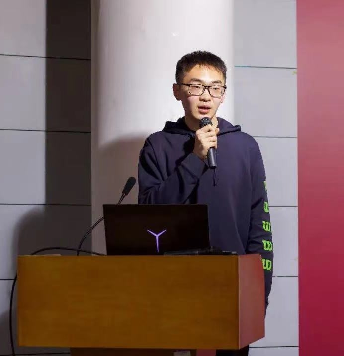

## Welcome to the HomePage of Xudong Lu

###### Do one thing at a time, and do well.

### General Information

I am an under graduate student from Department of Computer Science and Technology,  Shanghai Jiao Tong University (SJTU). 

I am now the Deputy Director of the Organization Department of the Youth League Committee of the School of Electronic Information and Electrical Engineering (SEIEE), Shanghai Jiao Tong University. I also served as one of the ministers of the secretariat of the college student union. At present, I also work as the secretary of the Youth League branch of class F1903303.

### Academic Performance

At present, my average course score is **93.44**, ranking **3 / 121** in my major. I got good grades in some computer related courses. Some detailed course grades is showed in the following List.

    
Course Grades

    
(CS356)Project Workshop of Operating System: 100

    
(CS386)Digital Graphics Processing: 99

    
(CS337)Computer Graphics: 99

    
(CS145)Experiments in Computer Organization: 98

    
(CS240)Computer Ethics: 97

    
(CS499)Mathematical Foundations of Computer Science: 96

    
(CS410)Artificial Intelligence: 96

    
(CS236)Cloud Computing: 96

    
(CS149)Data Structure: 95

    
(CS154)Thinking and Approach of Programming: 95

    
(CS307)Operating Systems: 95

    
(CS359)Computer System Architecture: 95

    
(CS241)Problem solving and Practice: 95

Links to some of my course projects are available in the following list.

    
 Course Projects

    
(CS236)<a href="https://github.com/Lucky-Lance/SJTU-CS236-Cloud-Computing">Cloud Computing</a>

    
(CS386)<a href="https://github.com/Lucky-Lance/DIP-football">Digital Graphics Processing</a>

    
(CS337)<a href="https://github.com/fangtiancheng/CG-AI-denoising">Computer Graphics</a>

    
(CS410)<a href="https://github.com/Lucky-Lance/SSR">Artificial Intelligence</a>

### Award and Scholarship Since Entering the University

- 2020: Excellent League member of Shanghai Jiao Tong University
- 2020: Three Good Students of Shanghai Jiao Tong University
- 2021: Outstanding League Cadres of Shanghai Jiao Tong University
- 2021: Outstanding Student Cadres of Shanghai Jiao Tong University

- 2020: National Scholarship
- 2020: Undergraduate Class A Scholarship of Shanghai Jiao Tong University
- 2021: National Scholarship
- 2021: Undergraduate Class A Scholarship of Shanghai Jiao Tong University

### Research Experience

- 2020-2022: intern at MVIG, SJTU [Machine Vision and Intelligence Group @ SJTU (github.com)](https://github.com/MVIG-SJTU)

